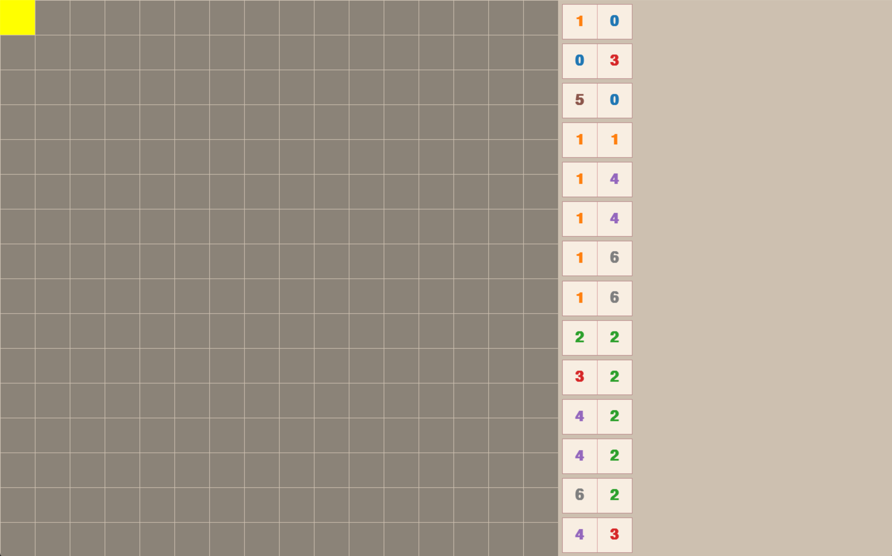

# Puzzle Overview

A puzzle starts with an empty grid and a sidebar of dominos. Your task is to place all of them onto the grid into a valid configuration.

Each **domino** covers **two adjacent cells**, and each side of a domino contains a **pip** value, **0** through **6**

## Valid Configuration

A configuration is valid if it satisfies the following rules:

> 1) **The placed domino cells form a single connected component**
> 
> So having 2 or more unconnected groups of dominos on the grid invalidates the configuration 

> 2) **The grid cells of any one pip value forms a single connected component**
> 
> So having 2 or more disjoint regions of the pip value 1 invalidates the configuration

> 3) **Neighboring cells cannot contain differing pip values unless part of the same domino**
>
> So having a [2,3] domino next to a [4,5] domino is not allowed

## Example Puzzle & Solution

Below is an example puzzle and its solution.

### 🟡 Puzzle Start

---

### 🟢 Puzzle Solution

